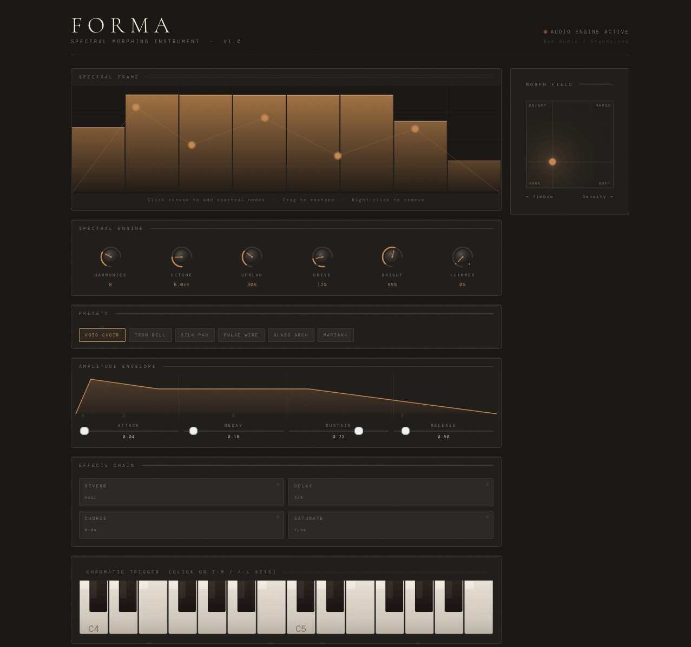

# FORMA — Spectral Morphing Instrument

> *A browser-native additive synthesis instrument built around direct spectral sculpting and a 2D tonal morph field.*



---

## What It Is

FORMA is a standalone digital instrument that runs entirely in the browser using the Web Audio API. Unlike conventional synthesizers that expose oscillator types or wavetables, FORMA lets you **draw your instrument's harmonic character directly** — placing spectral nodes on a frequency canvas that define how energy is distributed across the harmonic series. A 2D XY morph field then interpolates continuously between tonal states in real time.

The result is an instrument capable of textures that no static waveform or preset bank can produce: pads that shift tonally as you play, bells that bloom from dark to bright mid-sustain, choir-like clusters built from first principles.

---

## Features

| Module | Description |
|---|---|
| **Spectral Canvas** | Draw, drag, and remove harmonic nodes to define the instrument's tonal shape |
| **Morph Field (XY Pad)** | 2-axis continuous interpolation between timbre (odd/even harmonic balance) and density (brightness rolloff) |
| **Additive Engine** | Up to 24 harmonics per voice, 8-voice polyphony, real-time amplitude synthesis |
| **ADSR Envelope** | Full attack/decay/sustain/release with live canvas preview |
| **Spectral Knobs** | Harmonics, Detune, Spread, Drive, Brightness, Shimmer — all with drag interaction |
| **Effects Chain** | Convolution reverb, tempo-synced delay, chorus, tube saturation |
| **Chromatic Keyboard** | Clickable canvas keyboard + computer keyboard input (Z–M / A–L / Q–U rows) |
| **Preset Library** | 6 factory presets: Void Choir, Iron Bell, Silk Pad, Pulse Wire, Glass Arch, Mariana |
| **Output Meter** | Real-time stereo level metering with voice count display |

---

## Tech Stack

- **Runtime:** Vanilla JavaScript (ES2020+), no framework dependencies
- **Audio:** [Web Audio API](https://developer.mozilla.org/en-US/docs/Web/API/Web_Audio_API) — oscillators, gain nodes, convolution reverb, dynamics compressor, analyser
- **Rendering:** HTML5 Canvas 2D API (spectral display, morph pad, envelope, keyboard)
- **Styling:** Pure CSS with custom properties; no preprocessor required
- **Fonts:** [Google Fonts](https://fonts.google.com/) — Cormorant Garamond + DM Mono (loaded via CDN)
- **Build:** Zero-build — single HTML file, ships as-is

---

## Browser Compatibility

| Browser | Support |
|---|---|
| Chrome / Edge 89+ | ✅ Full |
| Firefox 76+ | ✅ Full |
| Safari 14.1+ | ✅ Full (`webkitAudioContext` handled) |
| Mobile Chrome/Safari | ✅ Touch supported |

Requires a browser with Web Audio API support. No server required.

---

## Getting Started

### Option 1 — Open directly (zero setup)

```bash
# Clone the repository
git clone https://github.com/williamhallpreston/forma-instrument.git
cd forma-instrument

# Open in browser
open index.html       # macOS
xdg-open index.html   # Linux
start index.html      # Windows
```

> **Note:** Some browsers restrict audio on `file://` URLs. If you hear nothing, use Option 2.

### Option 2 — Local dev server (recommended)

```bash
# Using Python (no install required)
python3 -m http.server 8080
# → Visit http://localhost:8080

# Using Node.js
npx serve .
# → Visit the URL shown in terminal

# Using VS Code
# Install the "Live Server" extension, then right-click index.html → "Open with Live Server"
```

### Option 3 — Deploy to GitHub Pages

```bash
# Push to main branch, then enable GitHub Pages in repo Settings → Pages → Source: main / root
# Your instrument will be live at: https://williamhallpreston.github.io/forma-instrument
```

---

## Usage

### Playing Notes

| Method | Keys / Action |
|---|---|
| **Computer keyboard — lower octave** | `Z X C V B N M` |
| **Computer keyboard — middle octave** | `A S D F G H J` |
| **Computer keyboard — upper octave** | `Q W E R T Y U` |
| **Mouse** | Click or click-drag on the on-screen keyboard |

### Sculpting the Spectrum

1. **Click** anywhere on the **Spectral Frame** canvas to add a harmonic node
2. **Drag** existing nodes to reshape the amplitude envelope across harmonics
3. **Right-click** a node to remove it
4. The displayed bars animate in response to the current spectral shape and active voices

### Using the Morph Field

The XY pad interpolates between four tonal extremes in real time:

```
Bright ←——————→ Harsh
  ↑                 ↑
Dark  ←——————→ Soft
```

- **X axis (Timbre):** Left = odd harmonics dominant (hollow, clarinet-like); Right = even harmonics boosted (full, organ-like)
- **Y axis (Density):** Up = dark (high harmonics attenuated); Down = bright (full harmonic presence)

Drag the cursor while holding a note to hear the morphing effect in real time.

### Knobs

| Knob | Range | Effect |
|---|---|---|
| Harmonics | 2–24 | Number of additive partials per voice |
| Detune | 0–50 ct | Random per-harmonic pitch offset |
| Spread | 0–100% | Scales the detune randomness across partials |
| Drive | 0–100% | Waveshaper saturation (tube-style curve) |
| Bright | 0–100% | Additional high-harmonic gain bias |
| Shimmer | 0–100% | Adds a detuned octave-up partial |

**Interaction:** Click-drag vertically to adjust. Double-click to reset to default.

---

## Project Structure

```
forma-instrument/
├── index.html              # Main instrument (self-contained)
├── src/
│   ├── engine/
│   │   ├── audio.js        # AudioContext init, signal chain, voice management
│   │   ├── synthesis.js    # Spectral amp calculation, additive oscillator builder
│   │   └── envelope.js     # ADSR logic
│   ├── ui/
│   │   ├── knobs.js        # Knob build, drag interaction, SVG update
│   │   ├── keyboard.js     # Canvas keyboard renderer and hit detection
│   │   ├── spectral.js     # Spectral canvas draw loop and node interaction
│   │   ├── morph.js        # XY pad renderer and morph state
│   │   ├── envelope-ui.js  # Envelope canvas renderer and slider bindings
│   │   └── meter.js        # Output level meter (rAF loop)
│   └── data/
│       └── presets.js      # Factory preset definitions
├── docs/
│   ├── screenshot.png      # UI screenshot for README
│   └── ARCHITECTURE.md     # Audio graph and design decisions
├── tests/
│   └── synthesis.test.js   # Unit tests for frequency/amplitude calculations
├── .env.example            # Environment variable template
├── .gitignore
├── CHANGELOG.md
├── LICENSE
└── README.md
```

> **Note:** `index.html` is the canonical single-file release build. The `src/` directory documents the logical module boundaries for contributors and future build-tool integration.

---

## Configuration

FORMA has no required environment variables — it runs fully client-side. The `.env.example` file documents optional configuration points for deployments that add analytics or remote preset storage.

```bash
cp .env.example .env
# Edit .env with your values (all optional)
```

---

## Development

No build step is required. Edit `index.html` directly and refresh the browser.

For contributors working on the modular source structure:

```bash
# Install optional dev tooling
npm install

# Run linter
npm run lint

# Run unit tests (synthesis math)
npm test

# Bundle src/ into a single file (optional)
npm run build
```

---

## Roadmap

- [ ] MIDI input support (Web MIDI API)
- [ ] Spectral state morphing across presets (A→B interpolation)
- [ ] Export current spectral shape as JSON preset
- [ ] Modulation matrix (LFO → morph X/Y, knob targets)
- [ ] Offline PWA mode (service worker caching)
- [ ] VST3/AU wrapper via JUCE WebView

---

## Contributing

Contributions are welcome. Please:

1. Fork the repository and create a feature branch (`git checkout -b feature/your-feature`)
2. Keep changes scoped — one feature or fix per PR
3. Follow the existing code style: vanilla JS, no transpilation, ES2020+ syntax
4. Test in Chrome and Firefox before submitting
5. Open a PR with a clear description of what changed and why

For large changes (new synthesis algorithms, UI overhauls), please open an issue first to discuss.

---

## License

MIT License — see [LICENSE](LICENSE) for full text.

You are free to use, modify, and distribute FORMA for personal and commercial projects. Attribution appreciated but not required.

---

## Credits

Designed and built as a demonstration of what browser-native audio tools can achieve when treated as first-class instruments rather than demos.

- Audio engine: [Web Audio API](https://developer.mozilla.org/en-US/docs/Web/API/Web_Audio_API)
- Typography: [Cormorant Garamond](https://fonts.google.com/specimen/Cormorant+Garamond) · [DM Mono](https://fonts.google.com/specimen/DM+Mono) via Google Fonts
- Inspired by: Buchla 200 series, Neve 1073, the philosophy of Don Buchla

---

*FORMA — because every sound has a shape.*
